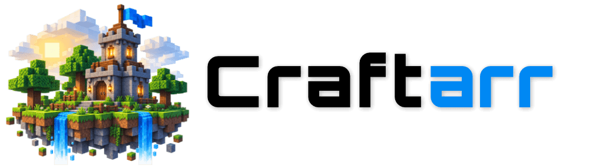
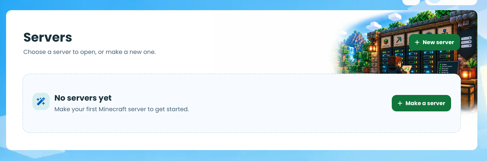
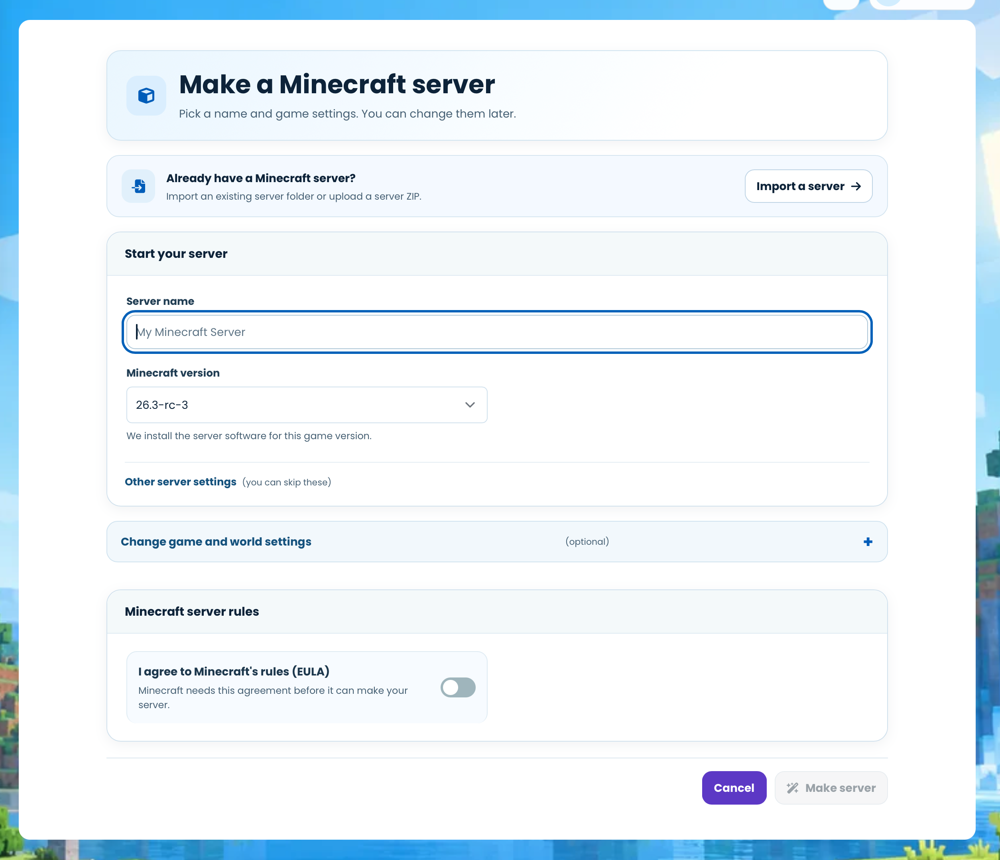
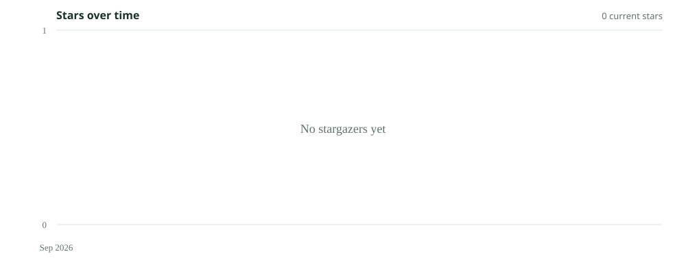

<div align="center">
  
  <h2>Minecraft Servers. Simplified.</h2>
  <p>Run, monitor, back up and automate Minecraft servers from one open-source web panel.</p>
  <p>
    <a href="https://github.com/STEMMechanics/Craftarr/releases/latest"></a>
    <a href="LICENSE"></a>
    <a href="https://github.com/STEMMechanics/Craftarr/actions/workflows/tests.yml"></a>
    
    
  </p>
</div>

<p align="center">
  
</p>

## What is Craftarr?

Craftarr is an open-source web management panel for Minecraft server operators. It brings server controls, a live console, player and plugin management, backups, monitoring and automation into one place.

Developed by **STEMMechanics**, Craftarr is an independent, general-purpose project that is also used internally to power STEMCraft.

## Features

- **Operate:** create or import servers, manage Java settings, control processes and use a live console.
- **Monitor:** follow server health, resource use, players, logs and plugin or Paper updates.
- **Protect:** manage files, schedule local and off-site backups, and restore or roll back changes.
- **Automate:** schedule server tasks and backup jobs, with notifications for important events.
- **Manage access:** assign roles and permissions across servers, users and administration tools.

## Screenshots and UI preview

<p align="center">
  
</p>
<p align="center"><em>Create a new server or import an existing server folder or ZIP.</em></p>

## Quick Start

Craftarr's production installer supports Ubuntu 22.04+ and Oracle Linux 8+ hosts with systemd:

```bash
curl -fsSL https://raw.githubusercontent.com/STEMMechanics/Craftarr/main/scripts/install.sh | sudo bash
```

On a fresh install, the installer prints a temporary administrator password once. Put the panel behind HTTPS before exposing it to an untrusted network. See the [installation guide](docs/installation.md) for reviewable installs, first login, upgrades and recovery.

## Supported platforms and requirements

| Area | Support |
| --- | --- |
| Minecraft | Java Edition |
| Server software | PaperMC is the primary supported target |
| Production OS | Ubuntu 22.04+ and Oracle Linux 8+ |
| Development | Python 3.10+; macOS is supported locally |
| Database | SQLite |
| Off-site backups | rclone (optional) |

Other Paper-compatible or Bukkit-derived servers may work, but are not currently tested as release targets. Windows is not currently supported.

## Documentation

- [Installation and deployment](docs/installation.md)
- [Administration: servers, backups, updates and security](docs/administration.md)
- [Plugin and Paper update monitoring](docs/update-monitoring.md)
- [Development setup](docs/development.md)
- [Contributing](CONTRIBUTING.md)
- [Security policy](SECURITY.md)

## Project Activity


## Star History

<picture>
  <source media="(prefers-color-scheme: dark)" srcset="assets/star-history/dark.svg">
  
</picture>

## Contributors

Contributors are authors of merged pull requests, ordered by contribution count and then alphabetically. See the [full contributor graph](https://github.com/STEMMechanics/Craftarr/graphs/contributors).

<!-- CONTRIBUTORS:START -->
<table><tbody>
<tr><td align="center" width="120"><a href="https://github.com/nomadjimbob"><br/><sub><b>nomadjimbob</b></sub><br/><sub>62 merged PRs</sub></a></td></tr>
</tbody></table>
<!-- CONTRIBUTORS:END -->

## Supporting Craftarr

Financial support helps fund Craftarr development, hosting, testing and continued maintenance.

<p><a href="https://www.stemmechanics.com.au/sponsor?ref=craftarr">Support Craftarr through STEMMechanics</a></p>

- **Card:** One-time and recurring contributions are available through Square on the [sponsorship page](https://www.stemmechanics.com.au/sponsor?ref=craftarr).
- **Bitcoin:** Donation address coming soon.

## Contributing

Bug reports, documentation improvements and pull requests are welcome. Start with the [contribution guide](CONTRIBUTING.md), or [open an issue](https://github.com/STEMMechanics/Craftarr/issues/new/choose).

## Security

Please report vulnerabilities privately through [Craftarr security advisories](https://github.com/STEMMechanics/Craftarr/security/advisories/new). See [SECURITY.md](SECURITY.md) for details.

## License

Craftarr is licensed under [GPL-3.0-or-later](LICENSE).

Craftarr is an independent implementation and is not affiliated with or endorsed by Mojang Studios or Microsoft. Minecraft is a trademark of Microsoft Corporation. The interface was inspired in part by [Fabricator](https://github.com/philderks/Fabricator); Craftarr does not contain Fabricator source code or assets.

---

<p align="center">Built and maintained by <a href="https://www.stemmechanics.com.au/">STEMMechanics</a>.</p>
